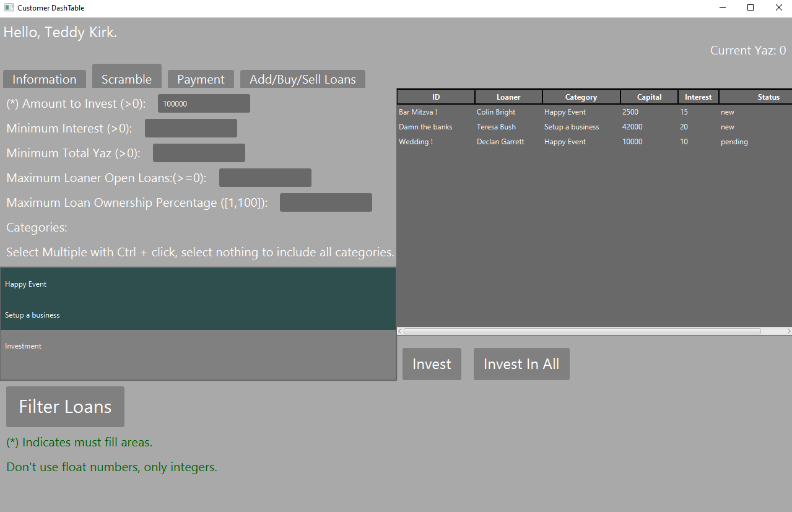
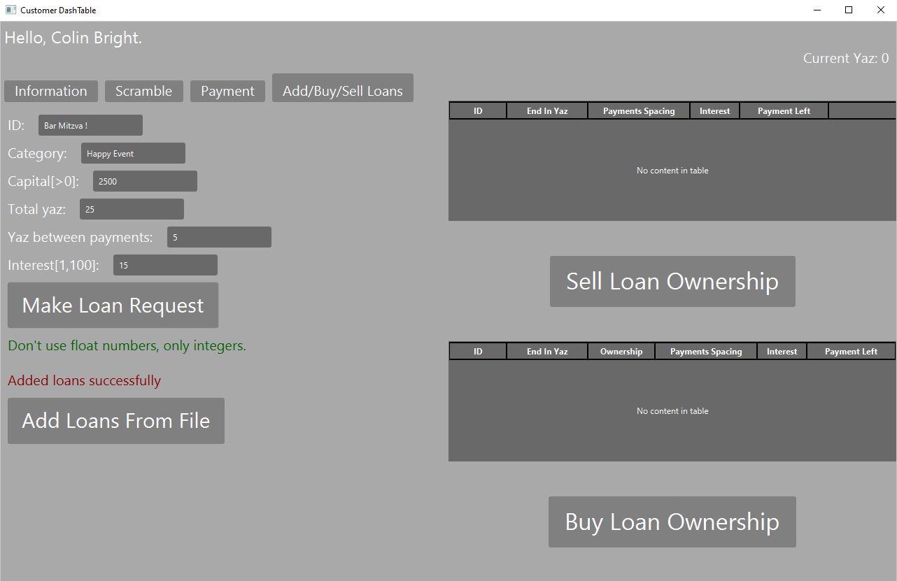
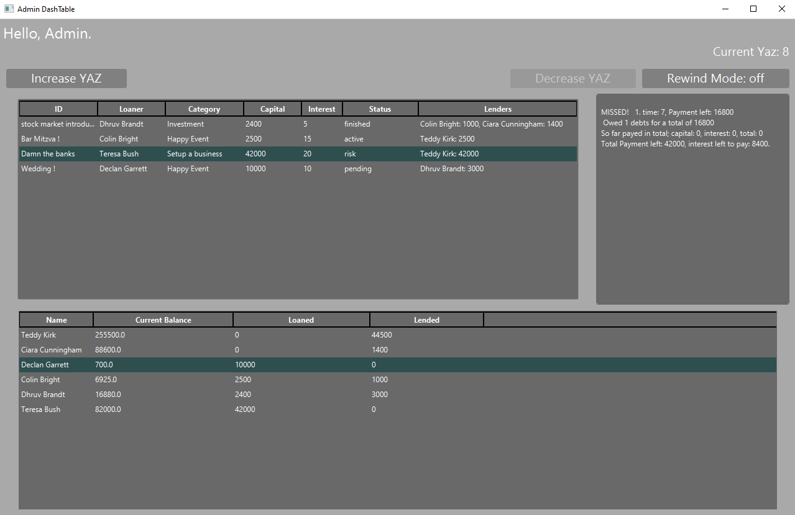

  <h3>
ABS (Alternative Banking System) is a project done in a java course in the Academic college of tel-aviv yaffo.    
ABS is a desktop application with a server, customer client and admin client. ABS Simulates a banking system, handles by customers, in there customers can take and loan to each other.
YAZ is a time unit in ABS, only admin can forward the time.
  </h3>

# Images

  
  
  
  

