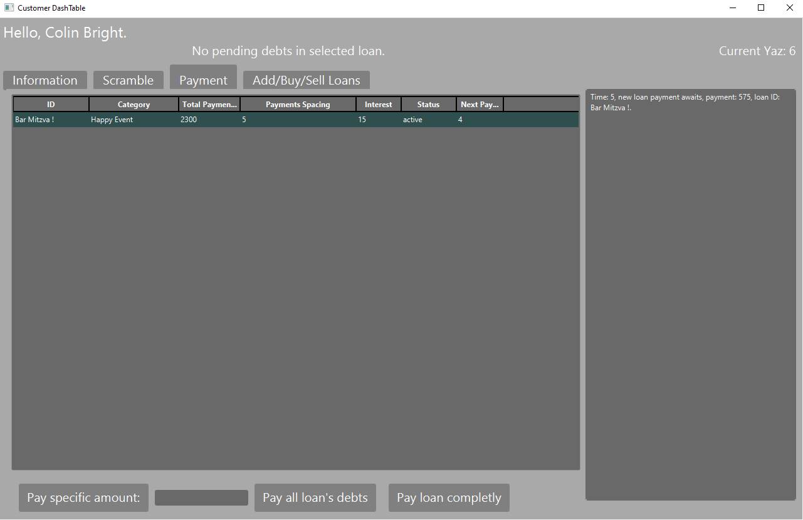

  <h3>
ABS (Alternative Banking System) is a project developed as part of a Java course at the Academic College of Tel-Aviv Yaffo. It is a desktop application featuring a server, customer client, and admin client, simulating a banking system where customers can issue loans to each other. The system uses a time unit called YAZ, which can only be advanced by the admin.
  </h3>

# Images

  
  
  
  

